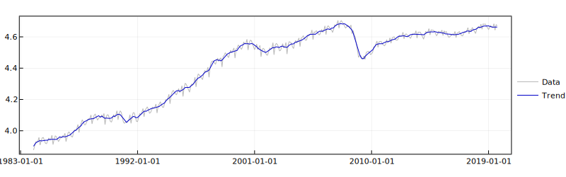

# TSAnalysis.jl
TSAnalysis.jl includes basic tools for time series analysis and state-space modelling.

```julia
import Pkg;
Pkg.add("TSAnalysis")
```

The implementation for the Kalman filter and smoother uses symmetric matrices (via ```LinearAlgebra```). This is particularly beneficial for the stability and speed of estimation algorithms (e.g., the EM algorithm in Shumway and Stoffer, 1982), and to handle high-dimensional forecasting problems.

## Examples
For these examples, I used economic data from FRED (https://fred.stlouisfed.org/), which is available in the ```FredData``` package. ```Optim``` and ```Plots``` are also used in the examples. These packages can be added via:

```julia
import Pkg;
Pkg.add("FredData");
Pkg.add("Optim");
Pkg.add("Plots");
```

To download the data, use the following code:
```julia
# Load FredData
using FredData;
f = Fred();

# Download Industrial Production: Manufacturing (NAICS), Log-levels (monthly, NSA)
fred_df = get_data(f, "IPGMFN", observation_start="1984-01-01", units="log");

# Store data in Array{Float64,1}
Y = fred_df.data.value;
```

Make sure that your FRED API is accessible to ```FredData``` (as in https://github.com/micahjsmith/FredData.jl). 

To run the examples below all the following packages must be loaded
```julia
using LinearAlgebra;
using Optim;
using Plots;
using TSAnalysis;
```

### Kalman filter
The following examples show how to perform standard univariate state-space decompositions. 

#### Local linear trend + noise decomposition
```julia
# Initialise the Kalman filter and smoother status
kstatus = KalmanStatus();

# Specify the state-space structure
ksettings = ImmutableKalmanSettings(permutedims(Y),
                                    [1.0 0.0], Symmetric(ones(1,1)*0.01),                # Observation equation
                                    [1.0 1.0; 0.0 1.0], Symmetric([1e-4 0.0; 0.0 1e-4]), # Transition equation
                                    zeros(2), Symmetric(1e3*Matrix(I,2,2)));             # Initial conditions

# Filter for t = 1, ..., T (the output is dynamically stored into kstatus)
for t=1:size(Y,1)
    kfilter!(ksettings, kstatus);
end

# Filtered trend
trend_llt = hcat(kstatus.history_X_post...)[1,:];
```

#### Local linear trend + seasonal + noise decomposition
```julia
# Initialise the Kalman filter and smoother status
kstatus = KalmanStatus();

# Specify the state-space structure

# Observation equation
B = hcat([1.0 0.0], [[1.0 0.0] for j=1:6]...);
R = Symmetric(ones(1,1)*0.01);

# Transition equation
C = cat(dims=[1,2], [1.0 1.0; 0.0 1.0], [[cos(2*pi*j/12) sin(2*pi*j/12); -sin(2*pi*j/12) cos(2*pi*j/12)] for j=1:6]...);
V = Symmetric(cat(dims=[1,2], [1e-4 0.0; 0.0 1e-4], 1e-4*Matrix(I,12,12)));

# Initial conditions
X0 = zeros(14);
P0 = Symmetric(cat(dims=[1,2], 1e3*Matrix(I,2,2), 1e-4*Matrix(I,12,12)));

# Settings
ksettings = ImmutableKalmanSettings(permutedims(Y), B, R, C, V, X0, P0);

# Filter for t = 1, ..., T (the output is dynamically stored into kstatus)
for t=1:size(Y,1)
    kfilter!(ksettings, kstatus);
end

# Filtered trend
trend_llts = hcat(kstatus.history_X_post...)[1,:];
```

### Kalman filter (prediction)
```TSAnalysis``` allows to compute *h*-step ahead predictions (at any point in time) without resetting the Kalman filter. 

#### Local linear trend + seasonal + noise decomposition
An easy way to compute the 12-step ahead prediction is to edit the block
```julia
# Filter for t = 1, ..., T (the output is dynamically stored into kstatus)
for t=1:size(Y,1)
    kfilter!(ksettings, kstatus);
end
```

into
```julia
forecast_history = Array{Array{Float64,1},1}();

# Filter for t = 1, ..., T (the output is dynamically stored into kstatus)
for t=1:size(Y,1)
    kfilter!(ksettings, kstatus);
    push!(forecast_history, (B*hcat(kforecast(ksettings, kstatus.X_post, 12)...))[:]);
end
```

### Kalman smoother
At any point in time, the Kalman smoother can be executed via
```julia
history_Xs, history_Ps, X0s, P0s = ksmoother(ksettings, kstatus);
```

### Estimation of the state-space parameters
This package does not provide direct support to estimate the state-space parameters. However, the estimation can be performed using ```TSAnalysis``` and ```Optim``` jointly. 

#### Local linear trend + seasonal + noise decomposition
```julia
function uc_model(θ_bound, Y, s)

    # Initialise the Kalman filter and smoother status
    kstatus = KalmanStatus();

    # Specify the state-space structure

    s_half = Int64(s/2);

    # Observation equation
    B = hcat([1.0 0.0], [[1.0 0.0] for j=1:s_half]...);
    R = Symmetric(ones(1,1)*θ_bound[1]);

    # Transition equation
    C = cat(dims=[1,2], [1.0 1.0; 0.0 1.0], [[cos(2*pi*j/s) sin(2*pi*j/s); -sin(2*pi*j/s) cos(2*pi*j/s)] for j=1:s_half]...);
    V = Symmetric(cat(dims=[1,2], [θ_bound[2] 0.0; 0.0 θ_bound[3]], θ_bound[4]*Matrix(I,s,s)));

    # Initial conditions
    X0 = zeros(2+s);
    P0 = Symmetric(cat(dims=[1,2], 1e3*Matrix(I,2+s,2+s)));

    # Settings
    ksettings = ImmutableKalmanSettings(permutedims(Y), B, R, C, V, X0, P0);

    # Filter for t = 1, ..., T (the output is dynamically stored into kstatus)
    for t=1:size(Y,1)
        kfilter!(ksettings, kstatus);
    end

    return ksettings, kstatus;
end

function fmin(θ_unbound, Y; s::Int64=12)

    # θ_unbound includes the variances for the innovations of noise, trend, drift and seasonal components
    θ_bound = 1e-8 .+ exp.(θ_unbound);

    # Compute loglikelihood
    ksettings, kstatus = uc_model(θ_bound, Y, s)

    # Return -loglikelihood
    return -kstatus.loglik;
end

θ_bound = 1e-8 .+ exp.(optimize(x->fmin(x, Y), zeros(4), SimulatedAnnealing()).minimizer);
```

More options for the optimisation can be found at https://github.com/JuliaNLSolvers/Optim.jl. 

The results of the estimation can be visualised using ```Plots```.
```julia
# Kalman smoother estimates
ksettings, kstatus = uc_model(θ_bound, Y, 12);
history_Xs, history_Ps, X0s, P0s = ksmoother(ksettings, kstatus);

# Plots backend
plotlyjs();

# Data vs trend
p1 = plot(fred_df.data.date, Y, label="Data", color=RGB(185/255,185/255,185/255),
          xtickfont=font(8, "Helvetica Neue"), ytickfont=font(8, "Helvetica Neue"),
          framestyle=:box, legend=:right, size=(800,250), dpi=300)

plot!(fred_df.data.date, hcat(history_Xs...)[1,:], label="Trend", color=RGB(0,0,200/255))
```


and
```julia
# Slope (of the trend)
p2 = plot(fred_df.data.date, hcat(history_Xs...)[2,:], label="Slope", color=RGB(0,0,200/255),
          xtickfont=font(8, "Helvetica Neue"), ytickfont=font(8, "Helvetica Neue"),
          framestyle=:box, legend=:right, size=(800,250), dpi=300)
```


## Bibliography
* R. H. Shumway and D. S. Stoffer. An approach to time series smoothing and forecasting using the EM algorithm. Journal of time series analysis, 3(4):253–264, 1982.
