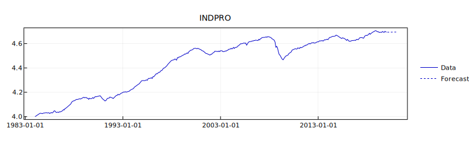
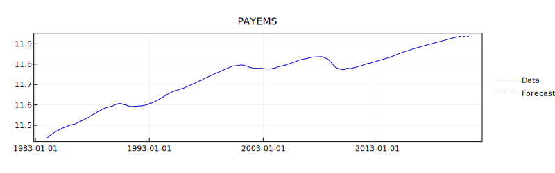
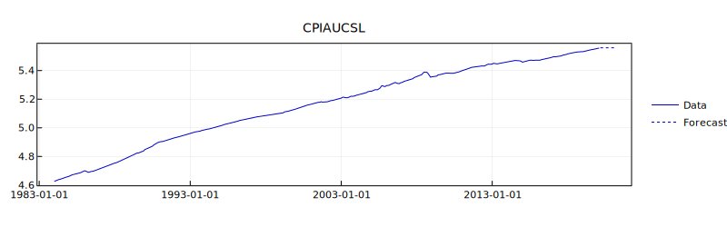
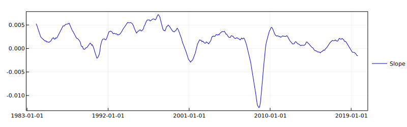

# TSAnalysis.jl
TSAnalysis.jl includes basic tools for time series analysis, compatible with incomplete data.

```julia
import Pkg;
Pkg.add("TSAnalysis")
```

## Preface

The Kalman filter and smoother included in this package use symmetric matrices (via ```LinearAlgebra```). This is particularly beneficial for the stability and speed of estimation algorithms (e.g., the EM algorithm in Shumway and Stoffer, 1982), and to handle high-dimensional forecasting problems.

For the examples below, I used economic data from FRED (https://fred.stlouisfed.org/), which is accessed via the ```FredData``` package. The dependencies for the examples can be installed via:

```julia
import Pkg;
Pkg.add("FredData");
Pkg.add("Optim");
Pkg.add("Plots");
Pkg.add("Measures");
```

Make sure that your FRED API is accessible to ```FredData``` (as in https://github.com/micahjsmith/FredData.jl).

To run the examples below, execute first the following block of code:
```julia
using Dates, DataFrames, LinearAlgebra, FredData, Optim, Plots, Measures;
using TSAnalysis;

# Plots backend
plotlyjs();

# Initialise FredData
f = Fred();

"""
    download_fred_vintage(tickers::Array{String,1}, transformations::Array{String,1})

Download multivariate data from FRED2.
"""
function download_fred_vintage(tickers::Array{String,1}, transformations::Array{String,1})

    # Initialise output
    output_data = DataFrame();

    # Loop over tickers
    for i=1:length(tickers)

        # Download from FRED2
        fred_data = get_data(f, tickers[i], observation_start="1984-01-01", units=transformations[i]).data[:, [:date, :value]];
        rename!(fred_data, Symbol.(["date", tickers[i]]));

        # Store current vintage
        if i == 1
            output_data = copy(fred_data);
        else
            output_data = join(output_data, fred_data, on=:date, kind = :outer);
        end
    end

    # Return output
    return output_data;
end
```

Additional examples are included in the ```/examples/``` folder.


## List of examples
- [State space models](#state-space-models)
  - [ARIMA models](#arima-models)
  - [VARIMA models](#varima-models)
  - [Kalman filter and smoother](#kalman-filter-and-smoother)
  - [Estimation of state-space models](#estimation-of-state-space-models)


### ARIMA models

#### Data

Use the following lines of code to download the data for the examples on the ARIMA models:
```julia
# Download data of interest
Y_df = download_fred_vintage(["INDPRO"], ["log"]);

# Convert to JArray{Float64}
Y = Y_df[:,2:end] |> JArray{Float64};
Y = permutedims(Y);
```

#### Estimation

Suppose that we want to estimate an ARIMA(1,1,1) model for the Industrial Production Index. TSAnalysis.jl provides a simple interface for that:
```julia
# Estimation settings for an ARIMA(1,1,1)
d = 1;
p = 1;
q = 1;
arima_settings = ARIMASettings(Y, d, p, q);

# Estimation
arima_out = arima(arima_settings, NelderMead(), Optim.Options(iterations=10000, f_tol=1e-2, x_tol=1e-2, g_tol=1e-2, show_trace=true, show_every=500));
```

Please note that in the estimation process of the underlying ARMA(p,q), the model is constrained to be causal and invertible in the past by default, for all candidate parameters. This behaviour can be controlled via the "tightness" keyword argument of the arima function.


#### Forecast

The standard forecast function generates prediction for the data in levels. In the example above, this implies that the standard forecast would be referring to industrial production in log-levels:
```julia
# 12-step ahead forecast
max_hz = 12;
fc = forecast(arima_out, max_hz, arima_settings);
```

This can be easily plotted via
```julia
# Extend date vector
date_ext = Y_df[!,:date] |> Array{Date,1};

for hz=1:max_hz
    last_month = month(date_ext[end]);
    last_year = year(date_ext[end]);

    if last_month == 12
        last_month = 1;
        last_year += 1;
    else
        last_month += 1;
    end

    push!(date_ext, Date("01/$(last_month)/$(last_year)", "dd/mm/yyyy"))
end

# Generate plot
p1 = plot(date_ext, [Y[1,:]; NaN*ones(max_hz)], label="Data", color=RGB(0,0,200/255),
                 xtickfont=font(8, "Helvetica Neue"), ytickfont=font(8, "Helvetica Neue"),
                 title="INDPRO", titlefont=font(10, "Helvetica Neue"), framestyle=:box,
                 legend=:right, size=(800,250), dpi=300, margin = 5mm);

plot!(date_ext, [NaN*ones(length(date_ext)-size(fc,2)); fc[1,:]], label="Forecast", color=RGB(0,0,200/255), line=:dot)
```



### VARIMA models

#### Data

Use the following lines of code to download the data for the examples on the VARIMA models:
```julia
# Tickers for data of interest
tickers = ["INDPRO", "PAYEMS", "CPIAUCSL"];

# Transformations for data of interest
transformations = ["log", "log", "log"];

# Download data of interest
Y_df = download_fred_vintage(tickers, transformations);

# Convert to JArray{Float64}
Y = Y_df[:,2:end] |> JArray{Float64};
Y = permutedims(Y);
```

#### Estimation

Suppose that we want to estimate a VARIMA(1,1,1) model. TSAnalysis.jl provides a simple interface for that:
```julia
# Estimation settings for a VARIMA(1,1,1)
d = 1;
p = 1;
q = 1;
varima_settings = VARIMASettings(Y, d, p, q);

# Estimation
varima_out = varima(varima_settings, NelderMead(), Optim.Options(iterations=20000, f_tol=1e-2, x_tol=1e-2, g_tol=1e-2, show_trace=true, show_every=500));
```

Please note that in the estimation process of the underlying VARMA(p,q), the model is constrained to be causal and invertible in the past by default, for all candidate parameters. This behaviour can be controlled via the "tightness" keyword argument of the varima function.


#### Forecast

The standard forecast function generates prediction for the data in levels. In the example above, this implies that the standard forecast would be referring to data in log-levels:
```julia
# 12-step ahead forecast
max_hz = 12;
fc = forecast(varima_out, max_hz, varima_settings);
```

This can be easily plotted via
```julia
# Extend date vector
date_ext = Y_df[!,:date] |> Array{Date,1};

for hz=1:max_hz
    last_month = month(date_ext[end]);
    last_year = year(date_ext[end]);

    if last_month == 12
        last_month = 1;
        last_year += 1;
    else
        last_month += 1;
    end

    push!(date_ext, Date("01/$(last_month)/$(last_year)", "dd/mm/yyyy"))
end

# Generate plot
figure = Array{Any,1}(undef, varima_settings.n)

for i=1:varima_settings.n
    figure[i] = plot(date_ext, [Y[i,:]; NaN*ones(max_hz)], label="Data", color=RGB(0,0,200/255),
                     xtickfont=font(8, "Helvetica Neue"), ytickfont=font(8, "Helvetica Neue"),
                     title=tickers[i], titlefont=font(10, "Helvetica Neue"), framestyle=:box,
                     legend=:right, size=(800,250), dpi=300, margin = 5mm);

    plot!(date_ext, [NaN*ones(length(date_ext)-size(fc,2)); fc[i,:]], label="Forecast", color=RGB(0,0,200/255), line=:dot);
end
```

Industrial production (log-levels)
```julia
figure[1]
```


Non-farm payrolls (log-levels)
```julia
figure[2]
```


Headline CPI (log-levels)
```julia
figure[3]
```



### Kalman filter and smoother

#### Data
The following examples show how to perform a standard univariate state-space decomposition (local linear trend + seasonal + noise decomposition) using the implementations of the Kalman filter and smoother in TSAnalysis.

The following examples use non-seasonally adjusted (NSA) data that can be downloaded using
```julia
# Download Industrial Production Index, Log-levels (monthly, SA)
fred_df = get_data(f, "IPGMFN", observation_start="1984-01-01", units="log");

# Store data in Array{Float64,2}
Y = permutedims(fred_df.data.value);
```

#### Kalman filter
```julia
# Initialise the Kalman filter and smoother status
kstatus = KalmanStatus();

# Specify the state-space structure

# Observation equation
B = hcat([1.0 0.0], [[1.0 0.0] for j=1:6]...);
R = Symmetric(ones(1,1)*0.01);

# Transition equation
C = cat(dims=[1,2], [1.0 1.0; 0.0 1.0], [[cos(2*pi*j/12) sin(2*pi*j/12); -sin(2*pi*j/12) cos(2*pi*j/12)] for j=1:6]...);
V = Symmetric(cat(dims=[1,2], [1e-4 0.0; 0.0 1e-4], 1e-4*Matrix(I,12,12)));

# Initial conditions
X0 = zeros(14);
P0 = Symmetric(cat(dims=[1,2], 1e3*Matrix(I,2,2), 1e3*Matrix(I,12,12)));

# Settings
ksettings = ImmutableKalmanSettings(Y, B, R, C, V, X0, P0);

# Filter for t = 1, ..., T (the output is dynamically stored into kstatus)
for t=1:size(Y,2)
    kfilter!(ksettings, kstatus);
end

# Filtered trend
trend_llts = hcat(kstatus.history_X_post...)[1,:];
```

#### Kalman filter (out-of-sample forecast)
```TSAnalysis``` allows to compute *h*-step ahead forecasts for the latent states without resetting the Kalman filter. This is particularly efficient for applications wherein the number of observed time periods is particularly large, or for heavy out-of-sample exercises.

An easy way to compute the 12-step ahead prediction is to edit the block
```julia
# Filter for t = 1, ..., T (the output is dynamically stored into kstatus)
for t=1:size(Y,1)
    kfilter!(ksettings, kstatus);
end
```

into
```julia
# Initialise forecast history
forecast_history = Array{Array{Float64,1},1}();

# 12-step ahead forecast
max_hz = 12;

# Filter for t = 1, ..., T (the output is dynamically stored into kstatus)
for t=1:size(Y,1)
    kfilter!(ksettings, kstatus);

    # Multiplying for B gives the out-of-sample forecast of the data
    push!(forecast_history, (B*hcat(kforecast(ksettings, kstatus.X_post, max_hz)...))[:]);
end
```

#### Kalman smoother
At any point in time, the Kalman smoother can be executed via
```julia
history_Xs, history_Ps, X0s, P0s = ksmoother(ksettings, kstatus);
```

### Estimation of state-space models
The estimation of state-space models for which TSAnalysis does not provide support yet can be performed by using ```TSAnalysis``` and ```Optim``` jointly. The data for the following examples is the same used for the previous section.

The state-space model described the previous section can be estimated following the steps below.

```julia
function llt_seasonal_noise(θ_bound, Y, s)

    # Initialise the Kalman filter and smoother status
    kstatus = KalmanStatus();

    # Specify the state-space structure

    s_half = Int64(s/2);

    # Observation equation
    B = hcat([1.0 0.0], [[1.0 0.0] for j=1:s_half]...);
    R = Symmetric(ones(1,1)*θ_bound[1]);

    # Transition equation
    C = cat(dims=[1,2], [1.0 1.0; 0.0 1.0], [[cos(2*pi*j/s) sin(2*pi*j/s); -sin(2*pi*j/s) cos(2*pi*j/s)] for j=1:s_half]...);
    V = Symmetric(cat(dims=[1,2], [θ_bound[2] 0.0; 0.0 θ_bound[3]], θ_bound[4]*Matrix(I,s,s)));

    # Initial conditions
    X0 = zeros(2+s);
    P0 = Symmetric(cat(dims=[1,2], 1e3*Matrix(I,2+s,2+s)));

    # Settings
    ksettings = ImmutableKalmanSettings(Y, B, R, C, V, X0, P0);

    # Filter for t = 1, ..., T (the output is dynamically stored into kstatus)
    for t=1:size(Y,2)
        kfilter!(ksettings, kstatus);
    end

    return ksettings, kstatus;
end

function fmin(θ_unbound, Y; s::Int64=12)

    # Apply bounds
    θ_bound = copy(θ_unbound);
    for i=1:length(θ_bound)
        θ_bound[i] = TSAnalysis.get_bounded_log(θ_bound[i], 1e-8);
    end

    # Compute loglikelihood
    ksettings, kstatus = llt_seasonal_noise(θ_bound, Y, s)

    # Return -loglikelihood
    return -kstatus.loglik;
end

# Starting point
θ_starting = 1e-8*ones(4);

# Estimate the model
res = Optim.optimize(θ_unbound->fmin(θ_unbound, Y, s=12), θ_starting, NelderMead(),
                     Optim.Options(iterations=10000, f_tol=1e-4, x_tol=1e-4, show_trace=true, show_every=500));

# Apply bounds
θ_bound = copy(res.minimizer);
for i=1:length(θ_bound)
    θ_bound[i] = TSAnalysis.get_bounded_log(θ_bound[i], 1e-8);
end
```

More options for the optimisation can be found at https://github.com/JuliaNLSolvers/Optim.jl.

The results of the estimation can be visualised using ```Plots```.
```julia
# Kalman smoother estimates
ksettings, kstatus = llt_seasonal_noise(θ_bound, Y, 12);
history_Xs, history_Ps, X0s, P0s = ksmoother(ksettings, kstatus);

# Data vs trend
p2 = plot(fred_df.data.date, Y', label="Data", color=RGB(185/255,185/255,185/255),
          xtickfont=font(8, "Helvetica Neue"), ytickfont=font(8, "Helvetica Neue"),
          framestyle=:box, legend=:right, size=(800,250), dpi=300)

plot!(fred_df.data.date, hcat(history_Xs...)[1,:], label="Trend", color=RGB(0,0,200/255))
```


and
```julia
# Slope (of the trend)
p3 = plot(fred_df.data.date, hcat(history_Xs...)[2,:], label="Slope", color=RGB(0,0,200/255),
          xtickfont=font(8, "Helvetica Neue"), ytickfont=font(8, "Helvetica Neue"),
          framestyle=:box, legend=:right, size=(800,250), dpi=300)
```


## Bibliography
* R. H. Shumway and D. S. Stoffer. An approach to time series smoothing and forecasting using the EM algorithm. Journal of time series analysis, 3(4):253–264, 1982.
